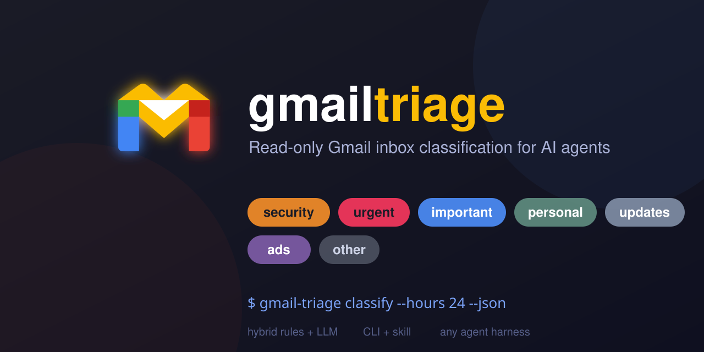

# gmail-triage




Read your Gmail inbox **read-only** and classify messages (important, ads, security, urgent, finance, travel, personal, updates, other) for AI agents. Ships as a Python CLI plus an opencode skill that teaches agents how to run it and finish the LLM part of classification.

## How classification works (hybrid)

1. **Deterministic rules (CLI):** Gmail's native category labels, bulk headers (`List-Unsubscribe`, `Precedence: bulk`), security/urgency/finance/travel keywords, and your allow/block lists in `config.yml`.
2. **LLM pass (agent):** messages the rules can't resolve (`rule_indeterminate: true`) are classified by the agent using the rubric in `skill/RUBRIC.md`. No API key needed — the agent is the LLM.

Categories: `security`, `urgent`, `finance`, `travel`, `important`, `personal`, `updates`, `ads`, `other`.

## Setup

### 1. Google Cloud OAuth client (one time)

1. Go to https://console.cloud.google.com/ and create a project (or reuse one).
2. **Enable the Gmail API** (APIs & Services → Library → "Gmail API" → Enable).
3. **Configure the OAuth consent screen** (APIs & Services → **Google Auth Platform** — this is what "OAuth consent screen" is now called):
   - **Audience** tab → **User type:** **External** (fine for personal use).
   - **Audience** tab → **Test users → Add users**: add the Google account you'll authorize with. **Required** — while the app is in *Testing* status, any account not listed here gets a `403 access_denied` when authorizing.
   - Scopes: add `https://www.googleapis.com/auth/gmail.readonly` (read-only!). Scopes are now configured per OAuth client under the **Clients** tab.
4. **Create OAuth client ID** (APIs & Services → Credentials → Create Credentials → OAuth client ID):
   - Application type: **Desktop app**.
   - Download the JSON and save it as `credentials.json` in this project dir.

### 2. Install

```bash
pip install -e .
```

### 3. Authenticate (one time, opens a browser)

```bash
gmail-triage auth-run
```

Token is saved to `.gmail-triage/<account>/token.json` (`default` account unless `--account` is given). Both `credentials.json` and `.gmail-triage/` are your secrets — don't commit them.

### Multi-account

Each account gets its own token under `.gmail-triage/<name>/`. Auth and read:

```bash
gmail-triage auth-run --account work          # first time per account
gmail-triage classify --account work --hours 24
```

## Usage

```bash
# All fetch/classify/report commands support these flags:
gmail-triage inbox    --since 2026-01-01 --until 2026-02-01 --json   # full window
gmail-triage classify --hours 24 --json                              # last 24h (agent-facing)
gmail-triage report   --since 2026-07-01 --format md                 # markdown digest
gmail-triage config                                                   # merged config
```

- `--since`/`--until` — ISO dates (`YYYY-MM-DD`); map to Gmail `after:`/`before:` (server-side filtering). `before:` is exclusive, so to include a day use the next day as `--until`.
- `--hours N` — shortcut; mutually exclusive with `--since`/`--until`.
- `--limit N` — caps results (default 100).
- `--full` — fetch full message bodies (default: snippet only).
- `--unread` — only unread messages (`is:unread`).
- `--label <name>` — scope: `inbox` (default), `spam`, `sent`, `draft`, `trash`, `archive`, `all`, `unread`, `starred`, or a custom label.
- `--query "<terms>"` — extra Gmail search terms, e.g. `from:paypal has:attachment`.
- `--account <name>` — which account to use (multi-account).
- `--format {text|md}` — report output format.
- `--no-collapse` — report flat message list instead of collapsing threads.

Every message's JSON features include: `is_unread`, `has_attachment`, `attachments` (name/mime/size), and `unsubscribe_url` (parsed from `List-Unsubscribe`).

### For an AI agent

Use `gmail-triage classify --json` and consume the JSON. Messages with `rule_indeterminate: true` are the ones the agent must classify itself using `skill/RUBRIC.md`. The `gmail-triage` opencode skill automates this whole loop — ask your agent to "triage my inbox" and it will run it.

### Harness-agnostic

The CLI is a plain command that reads Gmail and emits JSON — it is **not** tied to opencode and works with any harness agent that can run a shell command (Claude Code, Codex, Cursor, custom scripts, cron, …). Only the skill wrapper is opencode-specific; it's just instructions, so port it to another harness by copying the process steps into that harness's agent prompt (e.g. `.claude/CLAUDE.md`).

## Configuration

Edit `config.yml` to tune rules:

- `rules.security_keywords` / `rules.urgent_keywords` / `rules.finance_keywords` / `rules.travel_keywords` — keyword lists.
- `rules.allow_senders` — map `email -> category` (e.g. `boss@work.com: important`).
- `rules.block_senders` — map `email` (or subject pattern) `-> category` (e.g. `deals@shop.com: ads`).
- `rules.allow_domains` / `rules.block_domains` — whole-domain rules.

Precedence: `block_senders` → `allow_senders` → `block_domains` → `allow_domains` → security keywords → ads label → finance → travel → urgent keywords → bulk/updates.

## Safety

- OAuth scope is **read-only** (`gmail.readonly`). The tool cannot send, modify, or delete anything.
- The skill carries a hard read-only guardrail.

## Skill (opencode)

Two skills, sourced from this repo's `skill/`:

- **gmail-triage** (source: `skill/SKILL.md` + `skill/RUBRIC.md`) — triages the inbox.
- **gmail-triage-setup** (source: `skill/setup/SKILL.md`) — guided install, OAuth, multi-account, troubleshooting.

Installed at `~/.config/opencode/skills/gmail-triage/` and `~/.config/opencode/skills/gmail-triage-setup/`. To reinstall after edits:

```bash
cp skill/SKILL.md skill/RUBRIC.md ~/.config/opencode/skills/gmail-triage/
cp skill/setup/SKILL.md ~/.config/opencode/skills/gmail-triage-setup/
```

## License

[MIT](LICENSE)
